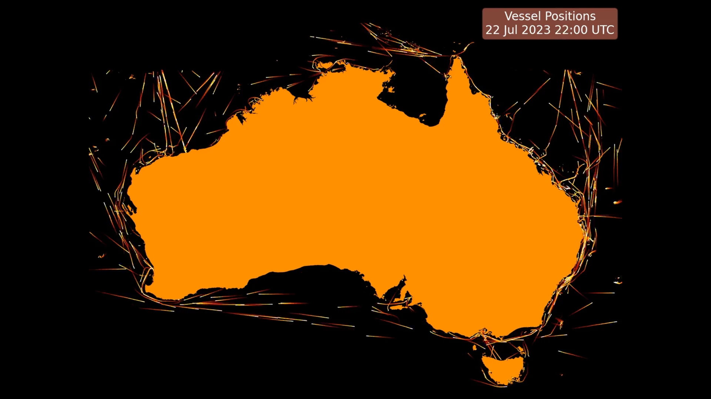

# Plotting Maritime Vessel Positions

The Australian Maritime Safety Authority [Digital Data website](https://www.operations.amsa.gov.au/Spatial/DataServices/DigitalData) has maritime vessel positions dating back over two decades. I love working with data that has a spatial and visual component as this sort of data is fun to visualise and easy to understand.

In this post I was going to share some tooling I created to make it easier to download and work with.

The main pain points I found working with this data is that it is difficult to easily pull down in bulk (since the webpage requires you accepting terms for each file you download) and the files you download are double-nested zip files containing a shape file. When I first worked with this data a few years ago I downloaded many years of it one month worth at a time and hand-extracted the zip files but it was onerous. This time I've prepared two scripts which I've saved in my [scrape_amsa_vessel_positions repo](https://github.com/owenlamont/scrape_amsa_vessel_positions), one to download all the zip files, and a second script to open the shape file in each double nested zip file and re-save it as a geo-parquet file. Both scripts by default only download and extract new data so you don't need to worry about re-running them.

Once you have a full directory of geoparquet files its very simple to open all the parquet files and concatenate them into a single [GeoPandas](https://geopandas.org/en/stable/) dataframe if you like (beware this will consume tens of gigabytes of RAM if you try to combine the full history though).

There's a few ways to visualise this data once you've collected it. I like leveraging the Matplotlib integration with [FFmpeg](https://ffmpeg.org) to create mp4 movies over time. Another easy way to visualise this data on a static image which looks really pretty is to create a heatmap with the [Datashader package](https://datashader.org).

Some of my different visualisations of this data I'll showcase in the [visualise_amsa_vessel_positions repo](https://github.com/owenlamont/visualise_amsa_vessel_positions)
