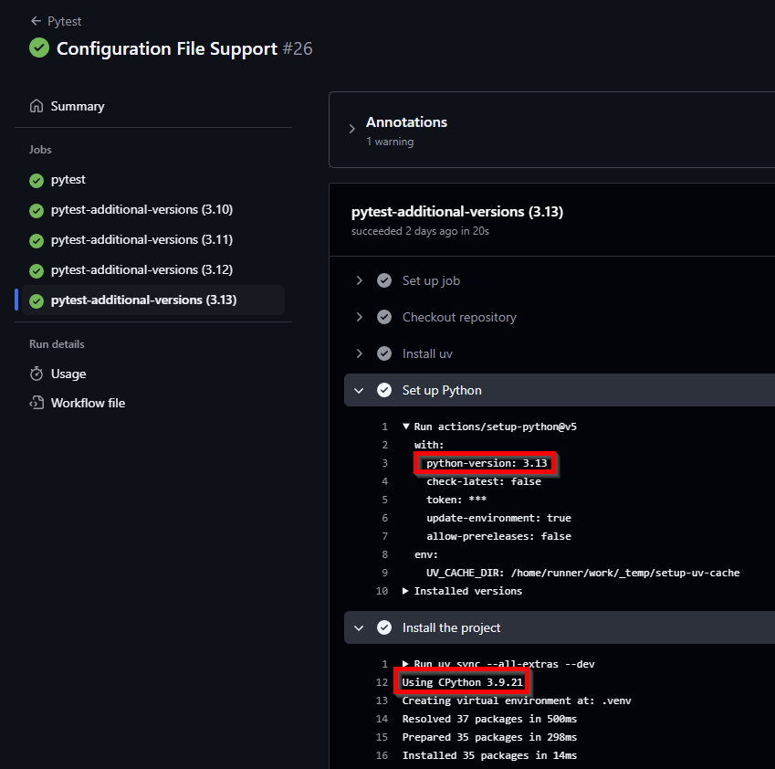
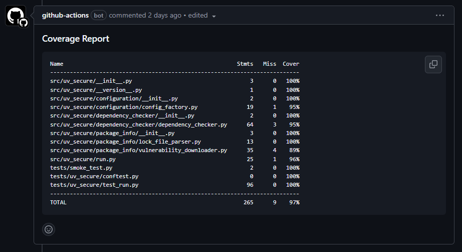

## Testing a Python Package on GitHub

I'm quite new both to building Python packages and also to GitHub actions so here I
describe setting up a workflow to run tests on a Python package across Windows, Ubuntu,
and macOS and across multiple Python versions with combined code coverage using
[GitHub actions](https://resources.github.com/learn/pathways/automation/) and
[uv](https://docs.astral.sh/uv/). I describe all the trial and error and mistakes I
encountered with the hopes it can save others some time.

## TLDR

I learnt how to set up a cross-platform / cross Python version workflow with coverage
while setting up the GitHub repo for my CLI tool
[uv-secure](https://github.com/owenlamont/uv-secure). You can see the final GitHub
action workflow I created for that project in
[pytest.yml](https://github.com/owenlamont/uv-secure/blob/main/.github/workflows/pytest.yml)
but beware this workflow depends on some configuration specified in other files of this
repo that I will go into in this post.

## My project setup

I created my package using uv init with the lib option:

```shell
uv init --lib
```

To create the skeleton package directory structure. The default uv init command is more
intended for creating scripts whereas if you want a Python project that will build and
install as a package then you need the --lib option. You can read more detail in the
[uv init docs](https://docs.astral.sh/uv/reference/cli/#uv-init)

That creates a repo structure with a

```shell
src / package_name
```

structure, and I personally like to add a top level tests directory (you need to do this
manually - uv won't create a tests directory for you) and then duplicate the directory
structure for the src directory for my tests structure, e.g.

```shell
tests / package_name
```

## Creating initial GitHub workflow

The uv documentation has a specific section for
[GitHub integration](https://docs.astral.sh/uv/guides/integration/github)
which I found to be an excellent starting point for setting up a GitHub action. I
started by copying their
[pytest example](https://docs.astral.sh/uv/guides/integration/github/#syncing-and-running)
and later tried to incorporate their other example of using
[multiple Python versions](https://docs.astral.sh/uv/guides/integration/github/#multiple-python-versions).

### First gotcha regarding Python versions

I made a few mistakes in my initial attempt to get multiple Python versions working that
were a bit painful to figure out, specifically:

I wanted to target Python 3.9 minimum and every major version after that up to Python
3.13. Given I was targeting 3.9 minimum I had a .python-version file in my repo with the
content:

```text
3.9
```

which I had checked into source control. I used the
[setup-python](https://github.com/actions/setup-python) action as the uv docs mentioned
that can be faster for setting up Python and passed the Python version to that using the
test matrix:

```yaml
- name: Set up Python
  uses: actions/setup-python@v5
  with:
    python-version: ${{ matrix.python-version }}
```

I saw the setup-python action installing the correct Python, so I assumed it was running
the tests against Python 3.9, 3.10, 3.11, 3.12, and 3.13... but unbeknownst to me uv was
reading the .python-version file in each case and creating a Python 3.9 environment in
each of the VMs even though actions/setup-python had installed the correct Python.



I didn't actually notice this issue until a later release when I tried to combine test
coverage reports across my Python versions and noticed they were all giving identical
results so coverage ignored all but one. The solution in this case was to remove the
.python-version file from source control - I still kept a local copy but added it to the
repo .gitignore file. Alternatively don't use the setup-python action and just follow
the uv documentation example where uv installs Python itself.

The more general learning I got was to take the time to inspect the action output more
closely for each step as you can see from the screenshot the problem was easy to spot -
but only if you expand and look at the detailed output for each step.

## Adding Code Coverage Support

There's several SaaS services for taking output from
[coverage](https://pypi.org/project/coverage/) in Python and tracking test coverage over
time such as [Codecov](https://about.codecov.io) or [coveralls](https://coveralls.io)
both of which offer free (maybe with limitations) support for open source projects.
However, I wanted to get some basic test coverage reporting that would work without
using those services (yet) so I implemented some simpler action steps to take the
coverage report from coverage and simply add that as a comment to the pull request.

The configuration for those steps looked like this in the end:

```yaml
- name: Run coverage report
  run:  uv run coverage report > coverage_summary.txt
- name: Prepare Comment Body
  run: |
    echo '### Coverage Report' >> comment_body.md
    echo '```txt' >> comment_body.md
    cat coverage_summary.txt >> comment_body.md
    echo '' >> comment_body.md
    echo '```' >> comment_body.md
- name: Find Coverage Report Comment
  id: find-comment
  uses: peter-evans/find-comment@v3
  with:
    issue-number: ${{ github.event.pull_request.number }}
    comment-author: github-actions[bot]
    body-includes: '### Coverage Report'
- name: Create or Update Coverage Comment
  uses: peter-evans/create-or-update-comment@v4
  with:
    token: ${{ secrets.GITHUB_TOKEN }}
    issue-number: ${{ github.event.pull_request.number }}
    body-path: comment_body.md
    comment-id: ${{ steps.find-comment.outputs.comment-id }}
    edit-mode: replace
```

I had some trial and error and issues with the echo calls in the Prepare Comment Body
step as I found I needed to use single tick quotes do get some of the echo calls to
work (they would give really confusing errors with different quotes).

I learnt of [Peter Evan's](https://github.com/peter-evans) really handy actions for
creating comments, although it took me a while to identify adding markdown comments
worked best if saved to a file and added via the body-path argument in the
[create-or-update-comment](https://github.com/peter-evans/create-or-update-comment)
action. I had many failed attempts trying to use ChatGPT's help to send the comment text
via an environment variable that just caused so many issues.

At first each change to a pull request would create a new coverage comment which got
messy pretty quickly but Peter had a
[nice example](https://github.com/peter-evans/create-or-update-comment#where-to-find-the-id-of-a-comment)
of combining his find-comment and create-or-update-comment actions so that you could
create an initial comment for the test coverage and keep overwriting that same comment
after that with new test coverage results as new commits were pushed to the PR.

The last gotcha I ran into with using the create-or-update-comment action was the
default job permissions aren't adequate for jobs to change the pull request itself so
you need to explicitly set the job permissions like this:

```yaml
jobs:
  my_job_name:
    runs-on: ubuntu-latest
    permissions:
      contents: read
      pull-requests: write
```

## Adding multi-Python version coverage report

I initially had multiple Python versions running and I just triggered test coverage for
one of the Python versions as a separate step. This was unsatisfactory though as there
was conditional importing happening in my package, e.g. toml parsing was added to the
standard library in later versions of Python but earlier versions required you to
import a separate package, e.g.

```python
if sys.version_info >= (3, 11):
    import tomllib as toml
else:
    import tomli as toml
```

and it was disappointing running coverage for just one Python version would always omit
one of these import lines. I learnt Coverage.py CLI has a
[combine](https://coverage.readthedocs.io/en/latest/cmd.html#cmd-combine) command so you
can run coverage for different environments and combine the results into a single
coverage result.

I had some initial misunderstandings around the combine command as I thought it might
combine one of the output files from running coverage, but it actually wants to combine
the .coverage SQLLite db that coverage produces when running. Another gotcha that I ran
into was when running coverage with an intent to combine results the coverage docs
mention using the:

```shell
--parallel-mode
```

option or configuration to name the .coverage to include extra details to ensure each
.coverage file is named uniquely and I tried to follow that advice. I had an issue
since I was using the [pytest-cov](https://pypi.org/project/pytest-cov/) package to
integrate pytest with coverage to run the tests with coverage, and pytest-cov appears to
set the parallel option for
[its own purposes](https://pytest-cov.readthedocs.io/en/latest/config.html#configuration)
so my attempts at enabling parallel mode never seemed to change the name of the
.coverage output db.

One possible solution would be to get coverage to run pytest without using pytest-cov (
although if you use the coverage feature in recent versions of the VSCode Python
extension that depends on pytest-cov so you may want to keep that dependency even if you
don't use it in CI).

In the end though it wasn't an issue because each test matrix instance runs in its own
VM so you don't need to worry about .coverage files overwriting each other - as long as
you use the upload-artifact action to upload them with different names there's no issue.

In the test run step I used the upload-artifact like so:

```yaml
- name: Upload coverage artifact
  uses: actions/upload-artifact@v4
  with:
    name: coverage-${{ matrix.python-version }}
    path: .coverage
    include-hidden-files: true
```

and a separate dependant job would collect and combine those individual test artifacts
like so:

```yaml
- name: Download all coverage artifacts
  uses: actions/download-artifact@v4
  with:
    path: coverage
- name: Combine coverage data
  run: |
    uv run coverage combine coverage/3.*/.coverage
    uv run coverage report > coverage_summary.txt
```

The include-hidden-files argument for upload-artifact was another gotcha as by default
upload-artifact won't upload _hidden_ files - such as those with a period prefix so to
get .coverage to upload you need to set that to true.

## Final step - adding multiple platform coverage support

In the same way I had conditional imports that imported different libraries depending on
the Python version - I also ended up needing conditional imports to handle different
operating system specific dependencies, e.g. for optimised async event loops
[uvloop](https://pypi.org/project/uvloop/) is often recommended but that only works on
Linux and macOS (and I hate it when Windows is neglected by Python packages since that
is the OS I work in the most). Once again I need a different conditional import on
Windows instead of uvloop I use [winloop](https://pypi.org/project/winloop/) and the
code looks like this:

```python
if sys.platform in ("win32", "cygwin", "cli"):
    from winloop import run
else:
    from uvloop import run
```

If you're interested the project dependencies section of my pyproject.toml for handling
those platform specific dependencies looks like this:

```toml
dependencies = [
    'tomli; python_version < "3.11"',
    "uvloop>=0.21.0 ; sys_platform != 'win32'",
    "winloop>=0.1.7 ; sys_platform == 'win32'",
]
```

so now the next issue is the GitHub matrix must be expanded to cover Linux, macOS, and
Windows and all the major Python versions which now looks like this:

```yaml
name: Pytest
on:
  pull_request:
jobs:
  pytest-with-coverage:
    runs-on: ${{ matrix.os }}
    strategy:
      matrix:
        os: ["ubuntu-latest", "macos-latest", "windows-latest"]
        python-version: ["3.9", "3.10", "3.11", "3.12", "3.13"]
```

One minor gotcha is don't forget to quote the Python version numbers - I tried unquoted
versions and Python 3.10 was trying to install Python 3.1!

The big gotcha happened though when I tried the step to combine the .coverage across my
multi-platform artifacts. The tests and individual coverage ran just fine but the
combine step returned an error status code but no meaningful / actionable error. I spent
a lot of time trying to reproduce the combine problem locally with the CI generated
artifacts and adding extra temporary debug steps into the pipeline before I determined
the issue was each GitHub CI ran the tests in a different absolute paths in their
respective VMs and coverage didn't recognise these different source paths as being the
same. Specifically the VM specific paths were:

- ubuntu-latest ran in: /home/runner/work/<repo_name>
- macos-latest ran in: /Users/runner/work/<repo_name>
- windows-latest ran in: D:/a/<repo_name>

I had run into this coverage directory mapping issue before when trying to run coverage
in PyCharm with a Docker environment because of the different (and very non-obvious)
absolute paths it creates for the same project directory.

In short, you need to configure coverage to recognise all these absolute directories as
the same path. Which I did in the pyproject.toml like so:

```toml
[tool.coverage.paths]
source = [
  "src",
  "/Users/runner/work/uv-secure/uv-secure/src",
  "/home/runner/work/uv-secure/uv-secure/src",
  "D:/a/uv-secure/uv-secure/src"
]
tests = [
  "tests",
  "/Users/runner/work/uv-secure/uv-secure/tests",
  "/home/runner/work/uv-secure/uv-secure/tests",
  "D:/a/uv-secure/uv-secure/tests"
]
```

You can read about other ways to configure these path mappings for coverage in its
[path docs](https://coverage.readthedocs.io/en/latest/config.html#paths)

Finally after all that trial and error I was able to get a single coverage report
workflow that covered all the major OSes and Python versions I wanted to cover. The
coverage comment renders like this:



## Related work and Summary

By chance while developing this I did discover the
[cookiecutter-uv](https://github.com/fpgmaas/cookiecutter-uv/) repo which covers a lot
of the same issues (but doesn't as far as I can see deal with combining the code
coverage).

I know the [tox](https://pypi.org/project/tox/) and [nox](https://pypi.org/project/nox/)
tools are often used for testing across multiple Python versions. I don't have
experience with them though, or know how they could be best integrated into GitHub CI.

Feel free to look at and re-use the final workflow file in your own repos which is here
[pytest.yml](https://github.com/owenlamont/uv-secure/blob/main/.github/workflows/pytest.yml)

I leaned on ChatGPT a lot which was good at suggesting the initial workflow
configuration, and it helped a lot with diagnosing the action output (by pasting in the
workflow yaml and the actual action log output) - but ChatGPT definitely lead me into
some dead ends where I needed to research and solve the problem myself (like the proper
way to use the create-or-update-comment action).

I've definitely found developing GitHub actions/workflows a bit painful as I spam push
commits with lots of trial and error until I get them to work right. I haven't tried but
have heard of the [act tool](https://github.com/nektos/act) that can apparently let you
test GitHub actions locally before pushing them. I'd be interested to hear how well that
has worked for other developers and what limitations it might have.
